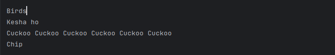
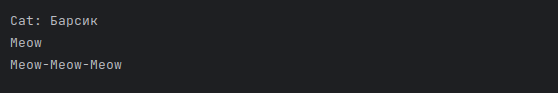
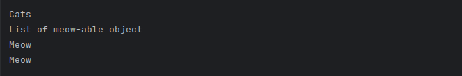
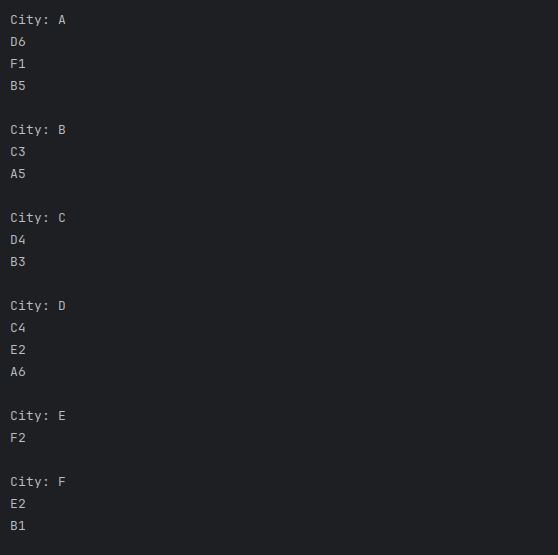
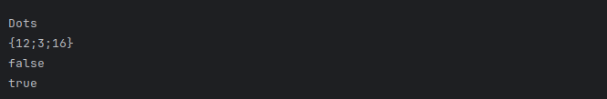
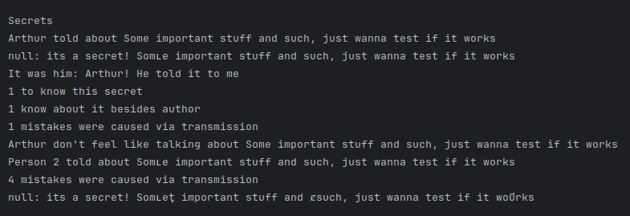

# Список лабораторных работ 
Основной код, а также файлы содержащие все текущие лабораторные работы за 2025. В течении семестра тут будут появляться дополнительные файлы, в соответствии с датами выполнения/исправления работ по курсу "Язык программирования Java".

## Содержание
- [О проекте](#о-проекте)
- [Установка](#установка)
- [Использование](#использование)
- [_Задачи лабораторной работы 1_](#Задачи-лабораторной-работы-1)
- [_Задачи лабораторной работы 2_](#Задачи-лабораторной-работы-2)
- [_Задачи лабораторной работы 3_](#Задачи-лабораторной-работы-3)
- [To Do](#to-do)
- [Команда проекта](#команда-проекта)

## О проекте
* Использованный язык: Java
* Тема: изучение языка Java в рамках курса университета

## Установка
Программа создавалась для использования с компилятором IntelliJ IDEA Community Edition.
Файлы вставить в существующий проект в папку ...\src после чего запустить код в компиляторе.
* _В будующем метод установки может, и скорее всего, изменится._

## Использование
После запуска программы будет предложен выбора лабораторной работы в консоли, после чего представлен ряд задач в исходном порядке. В процессе могут быть востребованны дополнительные данные, просьба о вводе которых отобразиться в консоли.
### Задачи лабораторной работы 1:
* ### Дробная часть
  
Дана сигнатура метода: public double fraction (double x);
Необходимо реализовать метод таким образом, чтобы он возвращал только дробную часть числа х. П
* ### Букву в число
  
Дана сигнатура метода: public int charToNum (char x);
Метод принимает символ х, который представляет собой один из “0 1 2 3 4 5 6 7
8 9”. Необходимо реализовать метод таким образом, чтобы он преобразовывал
символ в соответствующее число.
* ### Двузначное
  
Дана сигнатура метода: public bool is2Digits (int x);
Необходимо реализовать метод таким образом, чтобы он принимал число x и
возвращал true, если оно двузначное.
* ### Диапазон
  
Дана сигнатура метода: public bool isInRange (int a, int b, int num);
Метод принимает левую и правую границу (a и b) некоторого числового
диапазона. Необходимо реализовать метод таким образом, чтобы он возвращал
true, если num входит в указанный диапазон (включая границы). Обратите
внимание, что отношение a и b заранее неизвестно (неясно кто из них больше, а
кто меньше)
* ### Равенство
  
Дана сигнатура метода: public bool isEqual(int a, int b, int c);
Необходимо реализовать метод таким образом, чтобы он возвращал true, если
все три полученных методом числа равны.
* ### Модуль числа
  
Дана сигнатура метода: public int abs (int x);
Необходимо реализовать метод таким образом, чтобы он возвращал модуль
числа х (если оно было положительным, то таким и остается, если он было
отрицательным – то необходимо вернуть его без знака минус).
* ### Тридцать пять
  
Дана сигнатура метода: public bool is35 (int x);
Необходимо реализовать метод таким образом, чтобы он возвращал true, если
число x делится нацело на 3 или 5. При этом, если оно делится и на 3, и на 5, то
вернуть надо false. Подсказка: оператор % позволяет получить остаток от
деления.
* ### Тройной максимум
  
Дана сигнатура метода: public int max3 (int x, int y, int z);
Необходимо реализовать метод таким образом, чтобы он возвращал
максимальное из трех полученных методом чисел.
* ### Двойная сумма
  
Дана сигнатура метода: public int sum2 (int x, int y);
Необходимо реализовать метод таким образом, чтобы он возвращал сумму
чисел x и y. Однако, если сумма попадает в диапазон от 10 до 19, то надо вернуть
число 20.
* ### День недели
  
Дана сигнатура метода: public String day (int x);
Метод принимает число x, обозначающее день недели. Необходимо реализовать
метод таким образом, чтобы он возвращал строку, которая будет обозначать
текущий день недели, где 1- это понедельник, а 7 – воскресенье. Если число не
от 1 до 7 то верните текст “это не день недели”. Вместо if в данной задаче
используйте switch.
* ### Числа подряд
  
Дана сигнатура метода: public String listNums (int x);
Необходимо реализовать метод таким образом, чтобы он возвращал строку, в
которой будут записаны все числа от 0 до x (включительно).
* ### Четные числа
  
Дана сигнатура метода: public String chet (int x);
Необходимо реализовать метод таким образом, чтобы он возвращал строку, в
которой будут записаны все четные числа от 0 до x (включительно).
* ### Длина числа
  
Дана сигнатура метода: public int numLen (long x);
Необходимо реализовать метод таким образом, чтобы он возвращал количество
знаков в числе x.
* ### Квадрат
  
Дана сигнатура метода: public void square (int x);
Необходимо реализовать метод таким образом, чтобы он выводил на экран
квадрат из символов ‘*’ размером х, у которого х символов в ряд и х символов в
высоту.
* ### Правый треугольник
  
Дана сигнатура метода: public void rightTriangle (int x);
Необходимо реализовать метод таким образом, чтобы он выводил на экран
треугольник из символов ‘*’ у которого х символов в высоту, а количество
символов в ряду совпадает с номером строки, при этом треугольник выровнен
по правому краю.
* ### Поиск первого значения
  
Дана сигнатура метода: public int findFirst (int[] arr, int x);
Необходимо реализовать метод таким образом, чтобы он возвращал индекс
первого вхождения числа x в массив arr. Если число не входит в массив –
возвращается -1.
* ### Поиск максимального
  
Дана сигнатура метода: public int maxAbs (int[] arr);
Необходимо реализовать метод таким образом, чтобы он возвращал
наибольшее по модулю (то есть без учета знака) значение массива arr.
* ### Добавление массива в массив
  
Дана сигнатура метода: public int[] add (int[] arr, int[] ins, int pos);
Необходимо реализовать метод таким образом, чтобы он возвращал новый
массив, который будет содержать все элементы массива arr, однако в позицию
pos будут вставлены значения массива ins.
* ### Возвратный реверс
  
Дана сигнатура метода: public int[] reverseBack (int[] arr);
Необходимо реализовать метод таким образом, чтобы он возвращал новый
массив, в котором значения массива arr записаны задом наперед.
* ### Все вхождения
  
Дана сигнатура метода: public int[] findAll (int[] arr, int x);
Необходимо реализовать метод таким образом, чтобы он возвращал новый
массив, в котором записаны индексы всех вхождений числа x в массив arr.

### Задачи лабораторной работы 2:
* ### Имена
  
Создайте сущность Имя, которая описывается тремя параметрами: Фамилия, Личное имя, 
Отчество. Имя может быть приведено к строковому виду, включающему традиционное 
представление всех трех параметров: Фамилия Имя Отчество (например “Иванов Иван 
Иванович”). Необходимо предусмотреть возможность того, что какой-либо из параметров может 
быть не задан, и в этом случае он не учитывается при приведении к текстовому виду. 
Необходимо создать следующие имена: 
* Клеопатра 
* Пушкин Александр Сергеевич 
* Маяковский Владимир

Обратите внимание, что при выводе на экран, не заданные параметры никак не участвуют в 
образовании строки. 
* ### Человек с именем

Объедините сущности Человек из задачи 1.2 и Имя из задачи 1.3 таким образом, чтобы имя 
человека задавалось с использованием сущности 1.3, а не строки.  
Необходимо объединить ранее созданные объекты имен и людей, с получением: 
* Человека с Именем Клеопатра и ростом 152 
* Человека с Именем Пушкин Александр Сергеевичи ростом 167 
* Человека с Именем Маяковский Владимир и ростом 189 
* ### Человек с родителем

Измените сущность Человек из задачи 2.2 добавив ему возможность задавать третий параметр: 
Отец, где Отец — это тоже Человек. При приведении человека к строковой форме необходимо 
проверить параметры имени, и в зависимости от ситуации выполнить одно из следующих 
действий: 
* Если у данного человека нет фамилии, и есть отец, у которого фамилия задана, то 
фамилию необходимо сделать такой же как у отца. 
* Если у данного человека нет отчества, а у отца есть имя, то необходимо задать отчество 
как имя отца с добавлением суффикса “ович”.  
Затем необходимо выполнить следующие задачи: 
1. Создать людей: Чудова Ивана, Чудова Петра, Бориса 
2. Сделать Ивана отцом Петра, а Петра отцом Бориса 
3. Вывести на экран строковое представление всех троих людей.
* ### Города

Создайте сущность Город, которая будет представлять собой точку на карте со следующими 
характеристиками: 
* Название города 
* Набор путей к следующим городам, где путь представляет собой сочетание Города и 
стоимости поездки в него.

Кроме того, Город может возвращать текстовое представление, в виде названия города и списка 
связанных с ним городов (в виде пары: “название:стоимость”). 
Используя разработанную сущность реализуйте схему, представленную на рисунке 2.
* ### Создаем Имена

Измените сущность Имя из задачи 1.3. Новые требования включают: 
* Имя можно создать указав только Личное имя 
* Имя можно создать указав  Личное имя и Фамилию. 
* Имя можно создать указав все три параметра: Личное имя, Фамилию, Отчество. 
Необходимо создать следующие имена: 
1. Клеопатра 
2. Александр Сергеевич Пушкин 
3. Владимир Маяковский 
4. Христофор Бонифатьевич (здесь Христофор это имя, а Бонифатьевич - фамилия)
* ### Создаем человека

Измените сущность Человек из задачи 2.3. Новые требования включают: 
* Человека можно создать с указанием имени в виде строки и роста в виде целого числа. 
При таком способе задания имени должно считаться, что Человеку задано только личное 
имя. 
* Человека можно создать с указанием имени в виде строки, роста в виде целого числа и 
отца в виде Человека. В этом случае необходимо проставить отчество в соответствии с 
именем отца и присвоить текущему человеку фамилию отца. 
* Человека можно создать с указанием имени в виде объекта типа Имя (из задачи 4.5) и 
роста в виде целого числа.  
* Человека можно создать с указанием имени в виде объекта типа Имя (из задачи 4.5), 
роста в виде целого числаи отца в виде Человека. В этом случае необходимо проверить 
что в Имени задано отчество и фамилия, и если они не заданы, то необходимо их задать 
(отчество в соответствии с именем отца и фамилию отца). 
* Реализуйте описанные способы создания Человека таким образом, чтобы операции 
присвоения использовались только в одном из конструкторов.  
* Необходимо модифицировать способ приведения Человека к строке, теперь текстовая 
форма должна быть представлена строкой: “Имя, рост” 
Создайте и выведите на экран следующие объекты: 
1. Человека с именем Лев (в виде строки) и ростом 170 
2. Человека с именем Пушкин Сергей (как Имя), ростом 168 и отцом Львом (предыдущий Человек) 
3. Человека с именем Александр (в виде строки), ростом 167 и отцом Сергеем (предыдущий 
Человек)
* ### Кот мяукает

Создайте сущность Кот, которая описывается следующим образом: 
* Имеет Имя (строка) 
* Для создания необходимо указать имя кота. 
* Может быть приведен к текстовой форме вида: “кот: Имя” 
* Может помяукать, что приводит к выводу на экран следующего текста: “Имя: мяу!”, 
вызвать мяуканье можно без параметров. 
* Может помяукать Nраз, что приводит к выводу на экран следующего текста: “Имя: мяу
мяу-…-мяу!”, где количество “мяу”равно N. 
Создайте кота по имени “Барсик”, и затем пусть он помяукает сначала один раз, а затем три раза.

### Задачи лабораторной работы 3:
* ### Непустые Имена

Измените сущность Имя из задачи 1.4.5. Гарантируйте, что: 
* Как минимум один параметр будет иметь не null значение и не пустую строку. 
* Имя неизменяемо. 
Продемонстрируйте работоспособность решения на примерах.
* ### Человек меняется

Измените сущность Человек из задачи 1.4.6. Новые требования включают: 
* Рост человека всегда положительный и не более 500, его можно изменить и получить в 
любой момент. 
* Отца возможно задать только при создании и в дальнейшем он не изменяется, но его 
можно получить 
* Имя можно получить в любой момент в виде объекта типа Имя.  
Продемонстрируйте работоспособность решения на примерах.
* ### Секреты

Секреты никому нельзя рассказывать. Никому кроме одного самого близкого друга! Необходимо 
описать сущность Секрет, которая будет позволять хранить и передавать некоторый текст только 
одному другому хранителю. 
Состояние сущности описывают следующие сведения:  
* Текст секрета, в виде строки. 
* Имя хранителя секрета, в виде строки 
Инициализация сущности может быть выполнена следующим образом: 
* С указанием имени хранителя секрета и текста секрета, это будет означать создание 
нового секрета. 
* С указанием другого Секрета и именем хранителя секрета. В этом случае мы считаем, что 
секрет был рассказан другому человеку. При передаче секрета должно произойти 
следующее: во-первых, на консоль выводится текст вида “Имя сказал что Секрет”, где Имя 
и Секрет представляют собой имя того кто рассказывает секрет и текст секрета 
соответственно. Во-вторых, текст секрета у нового хранителя должен представлять собой 
копию текста предыдущего хранителя, но с добавлением Х случайных символов в Х 
случайных мест, где Х — это число в диапазоне от 0 до N, а Nв свою очередь это 10% от 
размера исходного текста. 
Поведение сущности описывают следующие действия: 
* Может быть приведен к строке, строковое преставление вида“Имя: это секрет!”, где Имя – 
это конкретное имя хранителя секрета, а остальное простой текст. 
* Можно узнать каким по очереди был данных хранитель секрета. 
* Можно узнать сколько еще человек узнали секрет после текущего хранителя 
* Можно получить имя N-го человек узнавшего секрет, причем N будет положительным для 
случая, когда мы хотим узнать имя следующего узнавшего секрет, и отрицательным если 
предыдущего. 
* Можно узнать разницу в количестве символов текста секрета с N-ым человеком 
Необходимо учесть следующие требования к инкапсуляции: 
* Единственным способом получить текст секрета может быт его вывод на экран при 
инициализации объекта. 
* Секрет может быть передан только одному другому человеку и не должно быть способа 
рассказать один и тот же секрет нескольким людям. 
Продемонстрируйте работоспособность решения на примерах.
* ### Трехмерная точка

Создайте такой подвид сущности Точка из задачи 1.1.1, которая будет иметь не две, а три 
координаты на плоскости: X,Y,Z.
* ### Птицы

Создайте сущность Птица, которая будет являться корнем иерархии для всех, кто является 
подвидом птицы. В разработанную сущность необходимо вынести все, что будет общим для птиц. 
Для того чтобы определить необходимые члены класса, проанализируйте три примера птиц: 
* Воробей. Умеет петь. При пении на экран выводится строка “чырык”. 
* Кукушка. Умеет петь. При пении на экран выводится текст“ку-ку”, причем текст 
выводится случайное количество раз в диапазоне от 1 до 10. 
* Попугай. Имеет текст и умеет петь этот текст. При инициализации обязательно 
необходимо указать текст, который будет исполняться. При пении текст выводится не 
весь, а первые Nсимволов (не менее одного и не более всех символов текста), где N 
определяется случайно.
* ### Мяуканье

Разработайте метод, который принимает набор объектов способных мяукать и вызывает 
мяуканье у каждого объекта. Мяукающие объекты должны иметь метод со следующей 
сигнатурой: 
public void meow(); 
Дополните решение задачи 1.5.2(Кот) так, чтобы иметь возможность передать Кота в 
написанный вами метод и протестируйте работоспособность решения передав в него нескольких 
котов, а также создайте любой другой произвольный класс и передайте в написанный метод его 
объекты. 
* ### Сравнение точек 

Измените сущность Точка из задачи 1.4.1. Переопределите метод сравнения объектов по 
состоянию таким образом, чтобы две точки считались одинаковыми тогда, когда они 
расположены в одинаковых координатах.
* ### Навести порядок
    
Данная задача предполагает реорганизацию ранее написанных классов. Расположите все ранее 
написанные классы по пакетам таким образом, чтобы логически близкие классы оказались 
сгруппированы друг с другом. Имена пакетов должны иметь как минимум трехсоставную форму, 
вида: ru.surname.type. Вместо surname следует подставить свою фамилию, а вместо type 
подставить название логического блока. Например, классы описывающие точку, линию, ломаную 
линию, фигуру, квадрат, треугольник, круг и прямоугольник можно расположить в пакете 
ru.surname.geometry.  
* ### Главный метод

Создайте пакет ru.surname.main (вместо surname необходимо подставить собственную 
фамилию) в котором расположить класс с точкой входа в исполнение программы (public static void 
main). Также следует проверить, что ни в одном другом пакете нет классов имеющих точку входа 
в исполнение программы. В этом же пакете необходимо расположить класс (или интерфейс) с 
методами из задач блока 2.5 и продемонстрировать их работоспособность.  
* ### Возведение в степень

Создайте метод принимающий две строки, в которых будут записаны числа X и Y. Возвращает 
метод результат возведения X в степень Y. Для преобразования строки в число следует 
использовать метод Integer.parseInt, а для возведения в степень метод Math.pow. Вызовите 
разработанный метод передав туда параметры командной строки полученные точкой входа в 
программу. Реализуйте метод так, что бы для возведения в степень и преобразования строки 
использовались короткие имена статических методов.
* ### Клонирование точки  

Измените сущность Точка из 3.6.2.Переопределите метод клонирования, унаследованный от 
класса Object, таким образом, чтобы при его вызове возвращался новый объект Точки, значения 
полей которого будут копиями оригинальной Точки.

## Тесты

## To do
- [x] Лабораторная работа 1
- [x] Лабораторная работа 2
- [x] Лабораторная работа 3
- [ ] Найти более оптимальный способ установки программы
- [ ] ...

 ## Команда проекта
 Завьялов Артур/Serr410
 Группа ИТ-11
***
